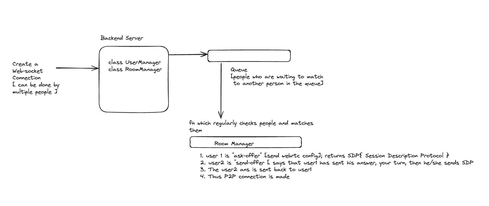

# Omegle-Clone
- WebRTC: Web Real Time Communication: UDP based protocol, packets can be lost but overall frame and communication
- UDP can fallback to TDP
- allows files + audio
- P2P allowed
- Thus 1000 people can be supported but 1-1 communication allowed
- FE: React + WebRTC API's
- BE: Signalling Server, Nodejs
- DB: Not needed

Backend Logic: 
